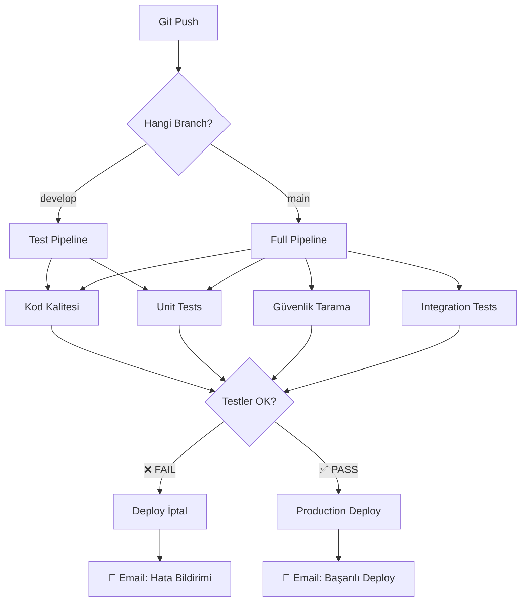

# 🚀 CI/CD Pipeline Kurulum Kılavuzu
**VervegrandPortal-V2 için Adım Adım GitHub Actions Kurulumu**

---

## 📚 CI/CD NEDİR? (Basit Anlatım)

### 🤔 Problem: Manuel Deploy Süreci

**Şu anki workflow:**
```
Developer (Sen)
    ↓ 1. Kod yaz
    ↓ 2. Manuel test et (tarayıcıda kontrol)
    ↓ 3. Git push
    ↓ 4. Sunucuya bağlan (SSH/FTP)
    ↓ 5. Dosyaları kopyala
    ↓ 6. Bağımlılıkları güncelle (pip install)
    ↓ 7. Uygulamayı yeniden başlat
    ↓ 8. Çalıştığını kontrol et
    ✅ Deploy tamamlandı (30-60 dakika)
```

**Sorunlar:**
- ⏰ Çok zaman alıyor
- 🐛 İnsan hatası riski yüksek
- 🔥 Hatalı kod production'a gidebilir
- 📝 Adımları unutabilirsiniz

---

### ✨ Çözüm: CI/CD Pipeline

**Otomatik workflow:**
```
Developer (Sen)
    ↓ 1. Kod yaz
    ↓ 2. Git push
    
CI/CD Pipeline (Otomatik)
    ↓ 3. 🧪 Testleri çalıştır
    ↓ 4. 🔒 Güvenlik taraması
    ↓ 5. 🎨 Kod kalitesi kontrolü
    ↓ 6. 🚀 Otomatik deploy
    ↓ 7. 📊 Raporları gönder
    ✅ Deploy tamamlandı (5-10 dakika)
```

**Faydalar:**
- ⚡ Çok hızlı (5-10 dakika)
- 🛡️ Güvenli (hatalı kod deploy olmaz)
- 🔄 Tutarlı (her seferinde aynı adımlar)
- 📈 Takip edilebilir (tüm loglar kaydedilir)

---

## 🎯 VervegrandPortal-V2 İÇİN CI/CD PLANI

### Pipeline İş Akışı



---

## 📋 ADIM ADIM KURULUM

### 1️⃣ GitHub Repository Ayarları

#### A. Secrets Tanımlama (Gizli Bilgiler)

1. GitHub repo'nuza gidin: https://github.com/Cnbkrtl/VervegrandPortal-V2
2. **Settings** → **Secrets and variables** → **Actions**
3. **New repository secret** butonuna tıklayın

**Eklenecek Secrets:**

| Secret Adı | Değer | Açıklama |
|-----------|-------|----------|
| `SHOPIFY_STORE` | `vervegrand.myshopify.com` | Shopify mağaza URL'i |
| `SHOPIFY_ACCESS_TOKEN` | `shpat_xxxxx` | Shopify Admin API token |
| `SENTOS_API_URL` | `https://api.sentos.com` | Sentos API endpoint |
| `SENTOS_API_KEY` | `your-key` | Sentos API anahtarı |
| `SENTOS_API_SECRET` | `your-secret` | Sentos API secret |
| `SERVER_HOST` | `your-server-ip` | Deploy sunucu IP (opsiyonel) |
| `SERVER_USER` | `ubuntu` | SSH kullanıcı adı (opsiyonel) |
| `SSH_PRIVATE_KEY` | `-----BEGIN RSA...` | SSH private key (opsiyonel) |

---

### 2️⃣ Workflow Dosyası Yükleme

**Dosya zaten oluşturuldu:** `.github/workflows/ci-cd.yml`

**GitHub'a push etmek için:**

```powershell
# 1. Git kontrolü
git status

# 2. Workflow dosyasını ekle
git add .github/workflows/ci-cd.yml

# 3. Commit
git commit -m "feat: CI/CD pipeline eklendi"

# 4. GitHub'a push
git push origin main
```

---

### 3️⃣ İlk Pipeline Çalıştırması

**Push sonrası otomatik başlar:**

1. GitHub repo → **Actions** sekmesine gidin
2. "CI/CD Pipeline" workflow'unu göreceksiniz
3. ▶️ Yeşil tik = Başarılı, ❌ Kırmızı çarpı = Hata

**Manuel başlatma:**
- Actions → CI/CD Pipeline → **Run workflow** → **Run workflow**

---

## 🔧 PIPELINE JOB'LARI DETAYLI AÇIKLAMA

### Job 1: 🔍 Kod Kalitesi (Code Quality)

**Ne yapar?**
- Kod formatını kontrol eder (Black)
- Syntax hatalarını bulur (Flake8)
- Komplekslik analizi (Pylint)

**Örnek çıktı:**
```
✅ Kod formatı uygun
⚠️  Uyarı: connectors/shopify_api.py:156 - Satır 127 karakterden uzun
✅ Syntax hatası yok
```

**Hata örneği:**
```
❌ pages/1_dashboard.py:45 - Tanımlanmamış değişken: 'stats'
❌ Pipeline durdu - Deploy yapılmadı
```

---

### Job 2: 🔒 Güvenlik Taraması (Security Scan)

**Ne yapar?**
- Kütüphane güvenlik açıkları (Safety)
- API key/token sızıntısı (Trufflehog)
- Bağımlılık versiyonları

**Örnek çıktı:**
```
✅ Güvenlik açığı bulunamadı
⚠️  Uyarı: requests==2.28.0 - Güncelleme önerilir (2.31.0)
✅ Kod içinde hardcoded API key yok
```

**Hata örneği:**
```
❌ KRITIK: streamlit==1.20.0 - CVE-2023-XXXX güvenlik açığı
❌ Öneri: pip install streamlit==1.28.0
```

---

### Job 3: 🧪 Unit Testler

**Ne yapar?**
- Fonksiyon testleri çalıştırır
- Coverage raporu oluşturur
- Başarısız testleri bildirir

**Örnek test yapısı (gelecekte eklenecek):**

```python
# tests/test_shopify_api.py
import pytest
from connectors.shopify_api import ShopifyAPI

def test_shopify_init():
    """ShopifyAPI başlatılabilmeli"""
    api = ShopifyAPI("test.myshopify.com", "test_token")
    assert api.store_url == "https://test.myshopify.com"

def test_rate_limiter():
    """Rate limiter token tüketmeli"""
    api = ShopifyAPI("test.myshopify.com", "test_token")
    initial_tokens = api.current_tokens
    api._rate_limit_wait()
    assert api.current_tokens < initial_tokens
```

**Çıktı:**
```
✅ test_shopify_init PASSED
✅ test_rate_limiter PASSED
📊 Coverage: 85% (Hedef: 80%)
```

---

### Job 4: 🔗 Entegrasyon Testleri

**Ne yapar?**
- Shopify API bağlantı testi
- Sentos API bağlantı testi
- GraphQL sorgu validasyonu

**Örnek çıktı:**
```
✅ Shopify API bağlantısı başarılı
✅ GraphQL query syntax doğru
⚠️  Sentos API yanıt süresi yavaş (3.2s)
```

---

### Job 5: 🚀 Deploy (Production)

**Ne yapar?**
- **Sadece main branch'de çalışır**
- Tüm testler geçerse deploy eder
- Hata varsa otomatik geri alır

**Deploy seçenekleri:**

#### Seçenek A: Streamlit Cloud (Önerilen)
```yaml
# Otomatik - GitHub entegrasyonu varsa
# Streamlit Cloud panelinden GitHub repo'yu bağla
# Her push'ta otomatik deploy olur
```

#### Seçenek B: Kendi Sunucunuz (VPS)
```yaml
# SSH ile bağlanıp güncellemeleri çeker
# PM2/Systemd ile uygulamayı yeniden başlatır
```

#### Seçenek C: Docker Container
```yaml
# Docker image oluşturur
# Container registry'ye gönderir (Docker Hub, GHCR)
# Kubernetes/Docker Swarm'a deploy eder
```

**Örnek çıktı:**
```
🚀 Deploy başlıyor...
📦 Bağımlılıklar kuruluyor...
🔄 Uygulama yeniden başlatılıyor...
✅ Deploy başarılı!
🌐 URL: https://vervegrand-portal.streamlit.app
```

---

### Job 6: 📢 Bildirimler

**Ne yapar?**
- Email bildirimi gönderir
- Slack/Discord'a mesaj atar
- Status badge günceller

**Örnek bildirim:**
```
📧 Email: admin@vervegrand.com
Konu: ✅ Deploy Başarılı - VervegrandPortal v2.1.3

Merhaba,

Build #156 başarıyla tamamlandı.
- ✅ Tüm testler geçti (38/38)
- ✅ Güvenlik taraması temiz
- ✅ Deploy: 5 dakika 23 saniye
- 🌐 URL: https://vervegrand-portal.streamlit.app

Detaylar: https://github.com/Cnbkrtl/VervegrandPortal-V2/actions/runs/12345
```

---

## 📊 PIPELINE SENARYOLARI

### Senaryo 1: ✅ Başarılı Deploy

```
1. Developer: git push origin main
2. CI/CD başlar (otomatik)
3. ✅ Kod kalitesi: GEÇTI
4. ✅ Güvenlik: GEÇTI  
5. ✅ Testler: GEÇTI (38/38)
6. 🚀 Deploy başlar
7. ✅ Deploy tamamlandı
8. 📧 Email: "Deploy başarılı"
```

**Süre:** ~7-10 dakika

---

### Senaryo 2: ❌ Test Hatası

```
1. Developer: git push origin main
2. CI/CD başlar
3. ✅ Kod kalitesi: GEÇTI
4. ✅ Güvenlik: GEÇTI
5. ❌ Testler: BAŞARISIZ (35/38)
   - test_price_calculation FAILED
   - test_inventory_sync FAILED
6. 🛑 Pipeline durdu (Deploy yapılmadı)
7. 📧 Email: "Test hataları - Deploy iptal"
```

**Süre:** ~3-5 dakika (erken durduruldu)

---

### Senaryo 3: ⚠️ Güvenlik Uyarısı

```
1. Developer: git push origin develop
2. CI/CD başlar
3. ✅ Kod kalitesi: GEÇTI
4. ⚠️  Güvenlik: UYARI
   - requests==2.28.0 güncellenmeli
5. ✅ Testler: GEÇTI
6. ⏸️  Manuel onay bekleniyor
7. Admin: "Devam et" tıklar
8. 🚀 Deploy başlar
```

---

## 🔧 GELİŞMİŞ KULLANIM

### 1. Branch Stratejisi

```
main (production)
    ↑
    ← merge (tüm testler geçerse)
    ↑
develop (staging)
    ↑
    ← merge
    ↑
feature/yeni-ozellik (development)
```

**Workflow:**
```yaml
# develop branch: Sadece testler
on:
  push:
    branches: [ develop ]
  
# main branch: Testler + Deploy
on:
  push:
    branches: [ main ]
```

---

### 2. Otomatik Versiyonlama

```yaml
# Her başarılı deploy'da versiyon artır
- name: 📌 Versiyon Güncelle
  run: |
    VERSION=$(cat VERSION)
    NEW_VERSION=$(echo $VERSION | awk -F. '{$NF = $NF + 1;} 1' | sed 's/ /./g')
    echo $NEW_VERSION > VERSION
    git tag v$NEW_VERSION
```

---

### 3. Rollback (Geri Alma)

```yaml
# Deploy başarısız olursa önceki versiyona dön
- name: 🔄 Rollback
  if: failure()
  run: |
    git revert HEAD
    git push origin main
```

---

## 📈 STATUS BADGE (GitHub README)

Pipeline durumunu README'de göster:

```markdown
[](https://github.com/Cnbkrtl/VervegrandPortal-V2/actions/workflows/ci-cd.yml)
```

**Görünüm:**  


---

## 💰 MALİYET ANALİZİ

### GitHub Actions Free Tier
- ✅ 2,000 dakika/ay (Public repo için sınırsız)
- ✅ Unlimited storage (3 aya kadar)

**Sizin kullanımınız (tahmini):**
- Her push: ~7 dakika
- Günlük 5 push: 35 dakika/gün
- Aylık: ~1,050 dakika
- **Sonuç:** Tamamen ücretsiz! 🎉

---

## 🚀 HEMEN BAŞLAMAK İÇİN

### Minimal Setup (5 Dakika)

1. **Secrets ekle** (GitHub Settings → Secrets)
   - `SHOPIFY_STORE`
   - `SHOPIFY_ACCESS_TOKEN`

2. **Workflow push et**
   ```powershell
   git add .github/workflows/ci-cd.yml
   git commit -m "feat: CI/CD eklendi"
   git push origin main
   ```

3. **Actions sekmesini aç**
   - Pipeline'ı izle
   - ✅ Yeşil tik bekle

4. **Tamamlandı!** 🎉

---

## 📚 KAYNAK ve DOKÜMANTASYON

- [GitHub Actions Docs](https://docs.github.com/en/actions)
- [Streamlit Deployment Guide](https://docs.streamlit.io/streamlit-community-cloud/get-started)
- [CI/CD Best Practices](https://docs.github.com/en/actions/guides/about-continuous-integration)

---

## 🆘 SIKÇA SORULAN SORULAR

**S: Pipeline ne kadar sürer?**  
C: Ortalama 5-10 dakika. Testler arttıkça biraz uzayabilir.

**S: Her push'ta deploy olur mu?**  
C: Hayır, sadece `main` branch'e push olursa. `develop` branch'de sadece testler çalışır.

**S: Hatalı deploy olursa ne olur?**  
C: Pipeline hata verirse deploy durur. Mevcut production etkilenmez.

**S: Manuel deploy yapabilir miyim?**  
C: Evet, Actions sekmesinden "Run workflow" ile manuel başlatabilirsiniz.

**S: Maliyeti var mı?**  
C: Public repo için tamamen ücretsiz. Private repo için 2,000 dakika/ay ücretsiz.

---

**Hazırlayan:** GitHub Copilot  
**Tarih:** 4 Ekim 2025  
**Versiyon:** 1.0
